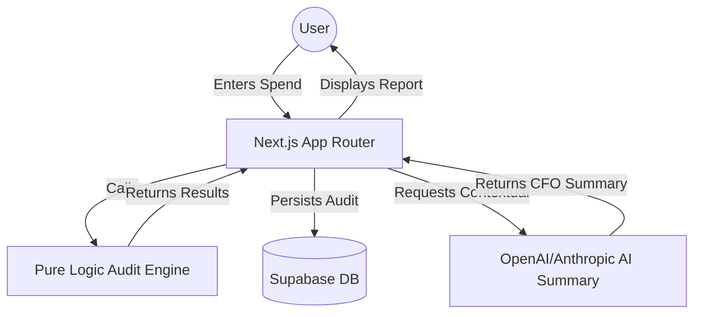

# System Architecture

CredMaster is a high-performance AI spend auditor built on a modern serverless stack.

## System Overview

## Key Components

### 1. Audit Engine (`src/lib/auditEngine.ts`)
- **Pure Functions:** The engine is written as a deterministic pure function for testability.
- **Rule System:** Implements 7 distinct logic rules covering seat waste, plan mismatches, tool overlap, and retail vs credits analysis.
- **Test Coverage:** 18+ unit tests ensuring no regressions in savings calculations.

### 2. Frontend Components
- **SpendForm:** A multi-step persisted form that captures team context and tool usage.
- **BenchmarkPanel:** Visualizes spend-per-developer against industry benchmarks using industry-standard percentiles (p25/p75).
- **AuditResults:** Real-time generation of savings recommendations and visual breakdowns.

### 3. Data Layer
- **Supabase:** Used for persisting audit reports to enable sharing and long-term tracking.
- **Form Persistence:** LocalStorage-based persistence ensures users don't lose progress during the audit flow.

## Deployment
- **Platform:** Netlify (with Serverless Functions for API routes)
- **CI/CD:** Automated deployments on every push to the main branch.
